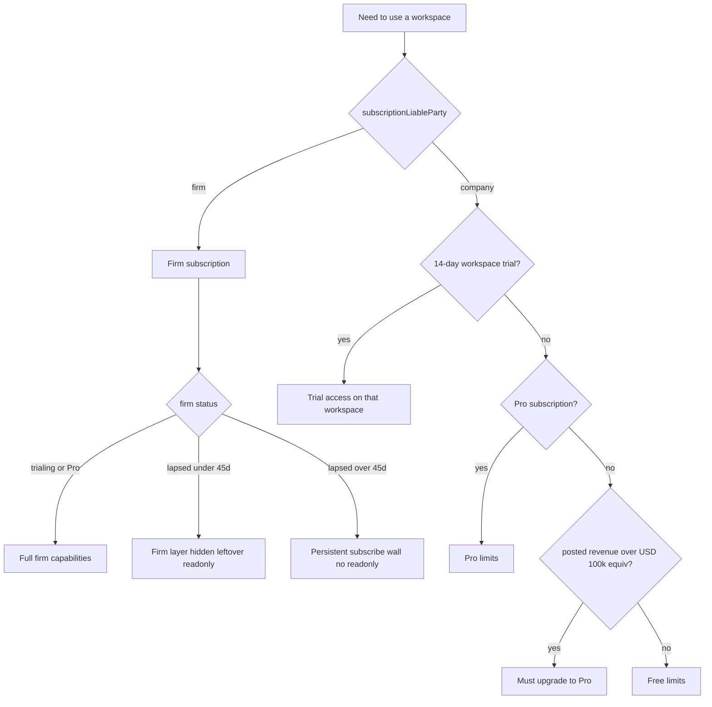
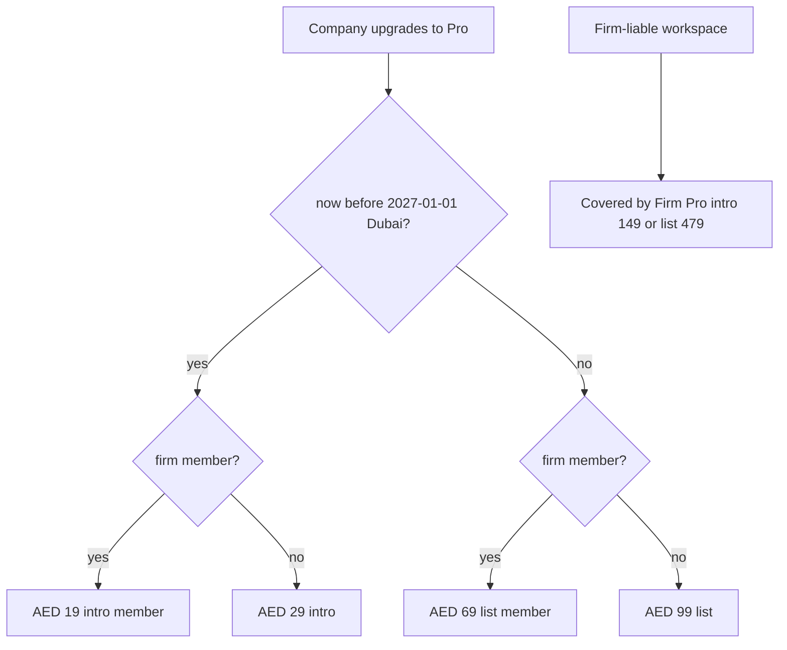
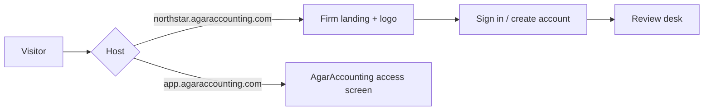

# Firm and client billing

## What already exists

No Stripe checkout, customers, or webhooks. Auth is Clerk; data is Postgres + Drizzle.

The product already split **who should pay**:

- Company-created workspace (`own_company`) → `subscriptionLiableParty = company`
- Firm-created workspace (`firm_client`) → `subscriptionLiableParty = firm`
- Ownership transfer (`company_transfer`) flips liability to `company`

Usage exists as a hardcoded **Starter** display plan (100 imports / 5 GB / 1000 AI / 5 workspaces) in [`artifacts/api-server/src/routes/agaraccounting.ts`](artifacts/api-server/src/routes/agaraccounting.ts). Limits are **not enforced**. Firm settings already say the firm is liable until transfer; the billing card is a placeholder (“Billing connection needed”).

`internal_rate_container` firm profiles are rate-sharing only — **never billed**.

## Recommended commercial model

Bill the **practice** and the **company books** as two products. Do not bill per staff seat in v1 (seats are a permission model today, not the scarce unit). Do not bill a firm for company-owned books they are merely engaged on.

### Process 1 — Firm (no free, 15-day trial)

Yes — **firms have a trial**. There is no firm Free tier.

**Rule:** trial = **full firm capabilities**. After trial without subscribe = firm layer **hidden**, leftover access **read-only** for **45 days**. After those 45 days still unsubscribed = **locked** — subscribe is persistent and cannot be closed to reach read-only pages.

Clock: trial days 0–15 from firm creation. Read-only window is the next **45 days after trial ends** (days 16–60). Lock starts on day 61 unless they are on Firm Pro.

- **Billed entity:** `agaraccounting_firm_profiles` where `profileKind = accounting_firm`
- **Clock starts:** firm profile creation (first-run `CompanyOnboarding` mode `firm` or `both`). That identity step is **not** gated — they must create the firm to start the trial.
- **During trial (`trialing`):** full system firm capabilities — identical to subscribed Firm Pro. Includes the in-development firm layer from [firm_specific_dashboard_509c991c.plan.md](c:\Users\cliff\.cursor\plans\firm_specific_dashboard_509c991c.plan.md):
  - `/firm-dashboard`, `/firm-clients/:id`, engagement onboarding (create / send / sign / confirm)
  - Firm settings, team, nominations, shared rates, report attribution
  - Create firm-liable clients, import, AI, post — subject only to the firm usage quota
  - White-labelled public landing (`{slug}.agaraccounting.com`) with the firm logo, headline, and sign-in CTA
- **After trial, days 1–45 unsubscribed (`lapsed_readonly`):** **hidden + read-only**
  - **Hidden:** Firm nav, `/firm-dashboard`, `/firm-clients/:id`, engagement onboarding wizard, firm Add-client / “Onboard a client”. Those APIs return 402/403. Landing is subscribe Firm Pro (dismissible enough to open existing firm-liable close-desk pages in read-only).
  - **Read-only:** existing firm-liable close-desk data can still be viewed if they already have workspace access. No new firm clients, no imports / AI / posts, no team invites or nominations, no firm settings writes.
  - Dual-mode users can still use `/user-portal` for their own company-owned books (that workspace’s Free/Pro). Engaged company-owned books stay on the company’s plan.
- **After 45 days still unsubscribed (`locked`):** **persistent subscribe wall**
  - Subscribe Firm Pro cannot be dismissed, closed, or routed around. No navigation to former read-only firm-liable pages (close desk, statements, journals, reports for `subscriptionLiableParty = firm`).
  - Those read APIs return 402 with `code: firm_locked`. Deep links and browser back land on the same wall.
  - Firm-only users: the wall is the whole app until they subscribe.
  - Dual-mode: wall applies to firm context only; they can still open their own `company_owned` workspaces. They cannot use the wall’s close button to sneak back into firm-liable read-only.
  - Subscribing to Firm Pro clears `locked` and restores full firm capabilities.

Suggested v1 firm quota: **5 firm-managed workspaces** (reuse today’s Starter number). Raise later with a second firm price or a per-client add-on — do not start there.

### Process 2 — Client / company (per workspace, not per user)

- **Billed entity:** each `agaraccounting_clients` row where `subscriptionLiableParty = company`. Creating another workspace (same or different name) is a **new** billable workspace with its own clock.
- **No per-user workspace cap.** No “1 Free company per owner” guard.
- **14-day trial:** starts when that company-liable workspace is created. Local trial (no card). During trial, treat limits as Pro-level so they can actually test.
- **After day 14:** that workspace drops to **Free forever** (limited). They can upgrade that workspace to Pro anytime.
- **Pro required by size:** if posted P&L **revenue** on that workspace exceeds **USD 100,000** (or the equivalent in the workspace `functionalCurrency` via existing FX rates), Free is no longer enough — they must subscribe to Pro on that workspace or writes that grow the books (import / AI / post) are blocked. Soft-warn as they approach the threshold.
- **Revenue definition (v1 default):** sum of posted income-statement accounts with `statementSection = revenue` in functional currency. Use the workspace’s current reporting period (the period already used for financial statements). Convert the USD 100k threshold into that currency with system/firm rates. Threshold amount and “current period vs trailing 12 months” stay configurable.
- **Pro:** Stripe subscription **on that workspace only**. Other workspaces the same user owns are unaffected.

### Dual-mode and transfer

- `onboardingMode = both` → two independent bills (firm 15-day trial/paid + each own-company workspace 14-day trial → Free/Pro)
- Firm staff invited onto a company-owned workspace do **not** pay for that workspace
- On `company_transfer`: liability flips to company; **start a fresh 14-day company trial** on that workspace (the new owner has not tested yet); firm quota frees a slot. Do not auto-charge the new owner.

## Recommended v1 prices (AED, monthly)

Stripe bills in **AED**. **List** is the real price; **intro** is what they pay until **end of 2026** (`2026-12-31 23:59:59` Asia/Dubai). UI always shows both, plus a live countdown to that instant.

| Plan | Intro (until 31 Dec 2026) | List (from 1 Jan 2027) | What they get |
|---|---|---|---|
| Company Free | AED 0 | AED 0 | 5 imports / 0.5 GB / 10 AI, after 14-day Pro-level trial |
| **Company Pro** | **AED 29** | **AED 99** | 100 imports / 5 GB / 1000 AI on that workspace |
| **Company Pro (firm member)** | **AED 19** | **AED 69** | Same Pro limits. Member discount on top of intro or list |
| **Firm Pro** | **AED 149** | **AED 479** | Full firm layer + 5 firm-liable workspaces (included, not charged Company Pro) + white-labelled landing (`{slug}.agaraccounting.com`) |

Copy pattern: ~~AED 99/mo~~ **AED 29/mo** introductory — “List price resumes 1 Jan 2027” + ticking countdown (`Xd Xh Xm Xs`). After the deadline, drop the intro column and countdown; show list only.

Annual (later, not v1): ~17% off **list**. UI shows AED only.

**Do not** put firm-liable books on Company Pro — those are inside Firm Pro (AED 149 now / AED 479 later). The member rate is only for **company-owned** workspaces that have hired a subscribed firm.

### Firm-member discount (how it works)

A company is a **firm member** when it has an **active** `firm_company_engagement` with a firm whose billing is `trialing` or Firm Pro `active`.

- Checkout picks the **current window** price **server-side** (never trust the client): intro vs list from `INTRO_RATES_END_AT`, then member vs standard.
- Six Stripe **Prices**, all `currency: aed` — three list + three intro. Do **not** use coupons for intro or member rates.
- Every checkout that uses an intro price also attaches a **Subscription Schedule** (or `subscription_data` + schedule) that switches that subscription to the matching **list** price at `2027-01-01T00:00:00+04:00` (29→99, 19→69, 149→479). Existing intro subscribers move automatically; they do not keep intro after 2026.
- When membership starts or ends **during** the intro window: swap 29↔19 (intro pair). **After** the window: swap 99↔69 (list pair). If the firm lapses, they stay on Pro at the standard price for the current window (29 intro or 99 list), not the member price.
- Several firms engaged: member rate if **any** engaged firm is `trialing` or `active`.
- Firm on trial: members get the member price for the current window.
- Free companies stay Free; the discount only applies when that workspace is on Pro (including the USD 100k-equivalent gate).
- Same Pro limits either way; only the **price** changes.

## Stripe shape (direct, not Clerk Billing)

Six prices in the Stripe dashboard; IDs in env (not hardcoded):

| Stripe product | Intro price (until end 2026) | List price (from 2027) | Customer |
|---|---|---|---|
| `firm` | AED 149 (`STRIPE_FIRM_INTRO_PRICE_ID`) | AED 479 (`STRIPE_FIRM_PRICE_ID`) | one per firm |
| `company_pro` | AED 29 (`STRIPE_COMPANY_PRO_INTRO_PRICE_ID`) | AED 99 (`STRIPE_COMPANY_PRO_PRICE_ID`) | one per company workspace |
| `company_pro` | AED 19 (`STRIPE_COMPANY_PRO_FIRM_MEMBER_INTRO_PRICE_ID`) | AED 69 (`STRIPE_COMPANY_PRO_FIRM_MEMBER_PRICE_ID`) | same company customer |

Also `INTRO_RATES_END_AT=2026-12-31T23:59:59+04:00` (Asia/Dubai). After that instant, new checkouts use list IDs only and skip the schedule.

Checkout + Customer Portal + webhooks. Create the Stripe customer at first checkout (firm: when they add a card; company: only on Pro upgrade for that workspace). Portal must not let a company self-switch to the member price without an eligible engagement — price changes only go through our API.

Webhook events to honor: `checkout.session.completed`, `customer.subscription.created|updated|deleted`, `invoice.paid`, `invoice.payment_failed`. **Stripe is source of truth**; local rows are a cache.

Metadata on every Stripe object: `liableParty`, `firmId` or `clientId`, `clerkUserId` of the purchaser.

## Entitlement resolution (single function)

Replace `USAGE_PLAN` with `resolveBilling(clientId)` for workspace writes and `resolveFirmBilling(firmId)` for the firm layer:

1. Read client `subscriptionLiableParty`
2. If `firm` → `resolveFirmBilling(firmId)` → `trialing` | `active` | `lapsed_readonly` (≤45 days after trial end) | `locked` (>45 days) | `past_due`
3. If `company` → `pro` if that workspace’s subscription is active; else `trialing` if within 14 days of company-liable start; else `free`
4. If `free` and posted revenue ≥ USD 100k equivalent → `requires_pro`
5. Return `{ payer, plan, status, limits, trialEndsAt, readonlyUntil, lockedAt, revenue, revenueThreshold }`

Firm-liable **reads** are allowed only while `trialing`, `active`, or `lapsed_readonly`. `locked` blocks reads and writes (402 `firm_locked`).

Call this on write paths that today ignore limits: statement import, AI activity, posting, and firm admin mutations. Do **not** block `POST /clients` for extra own-company workspaces — each new company-liable workspace starts its own 14-day trial.

Keep `/agaraccounting/usage` but make `plan` and limits come from the resolver (firm-pooled usage for firm-liable books; per-company usage for company-liable books).

### Proposed limit starting point (editable)

Free is a tight trial-after cap; Pro takes today’s Starter usage numbers:

- **Company trial (14 days):** Pro-level caps on that workspace
- **Company Free:** 5 statement imports / month, 0.5 GB evidence, 10 AI activities / month — **per workspace**, unlimited workspaces per owner
- **Company Pro:** today’s Starter numbers — 100 imports / month, 5 GB evidence, 1000 AI / month — **per workspace**
- **Firm (trial + paid):** same usage caps **pooled** across firm-liable workspaces, plus 5 firm-managed workspaces

Write-block at `at_limit`, when firm is `lapsed_readonly` or `locked`, or when a Free workspace is `requires_pro`. Soft-warn in UI at 80% of usage or revenue threshold. `locked` also blocks firm-liable **reads**.

## Data model

Add billing tables rather than stuffing Stripe IDs only onto firm/client (firms and companies are different payers):

- `agaraccounting_billing_accounts` — `payerType` (`firm` | `company`), `firmId` | `clientId`, `stripeCustomerId`, `email`
- `agaraccounting_subscriptions` — `stripeSubscriptionId`, `stripePriceId`, `planKey` (`firm` | `company_pro` | `company_pro_firm_member`), `status`, `trialEndsAt`, `currentPeriodEnd`, `cancelAtPeriodEnd`

Local trials (no Stripe required): insert a `trialing` row at **firm** creation (15 days) and at each **company-liable workspace** create/transfer (14 days). Stripe subscription is created only when they add a card / upgrade. Testing is not blocked on payment UI.

Do **not** put plan state in Clerk metadata.

## UI

- **Firm:** subscribe / trial countdown surface (also the post-lapse landing). [`FirmSettingsPage`](artifacts/agaraccounting/src/App.tsx) billing card — plan, trial countdown, **intro vs list** (AED 149 shown against ~~AED 479~~), intro-window ticker, Manage billing (Stripe portal), firm-managed workspace count. Settings identity may stay visible so they can upgrade; dashboard and onboarding do not.
- **Firm locked:** full-page subscribe wall, no close / skip / backdrop-click. Same intro/list + ticker. Not a dismissible modal. History and in-app nav cannot reach firm-liable read-only routes.
- **Company:** [`ClientSettingsPage`](artifacts/agaraccounting/src/App.tsx) — trial countdown / Free / Pro, Upgrade at intro AED 29 (or **AED 19 firm-member**) with list ~~AED 99~~ / ~~AED 69~~ still visible, intro-window ticker, portal, revenue vs USD 100k-equivalent progress
- **Intro ticker:** shared component, server `introEndsAt`, client ticks every second. Hide after `INTRO_RATES_END_AT`. Do not invent the remaining time on the client from a hardcoded date only — use the API so clock skew is one source.
- Global banner when a trial &lt; 5 days, firm is in the 45-day read-only window, or Free workspace over the revenue threshold
- Usage section already exists; point it at the resolver
- Hide upgrade on firm-liable workspaces (“Billed to {firm name}”)
- **White label (Firm Pro / trial):** Firm settings card to set a unique slug, upload/remove a JPEG/PNG/WebP logo (max 2 MB, no SVG), edit headline/tagline, and toggle publish. Public page is `{slug}.agaraccounting.com`. Path fallback `/f/{slug}` for environments without wildcard DNS. The page is public only while the firm is `trialing`, `active`, or `past_due` **and** `landingEnabled`. After lapse it 404s until they resubscribe. Reserved slugs: `www`, `api`, `app`, `admin`, `mail`, `cdn`, `staging`. Owners/admins edit; other firm members see the card read-only. Settings thumbnail uses a private logo route so unpublished/lapsed firms still see the saved file. Preview opens saved published content in a new tab.

## White-labelled firm landing

Firm Pro (and the 15-day firm trial) includes a branded client-facing landing page. It is **not** a Company Pro feature.

- **URL:** `https://{slug}.agaraccounting.com`. Slug is unique, 3–32 chars, `[a-z0-9-]`, assigned from the firm name at creation and editable in Firm settings.
- **Content:** firm logo (or initials), legal name, optional headline and tagline, Sign in CTA. Footer still names AgarAccounting AI as the platform.
- **Who edits:** firm `owner` or `admin` only. Accountants/bookkeepers can view the settings card.
- **Logo:** public `GET /public/firm-landing/:slug/logo` is gated the same as the landing. Settings preview uses authenticated `GET /workspace/firm-branding/logo` so a saved logo still renders when unpublished or lapsed.
- **Gate:** `resolveFirmBilling(firmId).fullAccess` **and** `landingEnabled`. Lapsed, locked, or unpublished firms 404 the public page.
- **Preview:** `/f/{slug}` in a new tab shows **saved** published content, not unsaved form fields. Copy address copies `https://{slug}.agaraccounting.com`.
- **Signed-in vs signed-out:** a signed-out visitor on a firm host sees the branded landing. A signed-in user on that host enters the app.
- **DNS / Clerk:** production needs wildcard `*.agaraccounting.com` **and** those hosts allowed in Clerk. Until that exists, `/f/{slug}` on the main host serves the same page and sign-in works without satellite domains.

## Implementation phases

**Phase 1 — Entitlements without charging.** Schema, resolver, local firm 15-day trial, 45-day read-only then `locked`, local per-workspace 14-day company trial, Free limits, revenue-threshold `requires_pro` gate. No Stripe keys needed.

**Phase 2 — Stripe.** Checkout sessions, portal, webhook idempotency, six price IDs + `INTRO_RATES_END_AT`, subscription schedule to list on 1 Jan 2027, mid-cycle member-price swap in the current window.

**Phase 3 — UI + transfer.** Billing pages, banners, usage copy, transfer starts a company 14-day trial and releases firm quota.

**Phase 4 — Tests.** Isolation tests already cover liability; add billing tests for: firm trial expiry → read-only, day 46 lock, two company workspace clocks, transfer trial, revenue threshold, dual-mode, checkout uses intro AED 19 when member during 2026 else intro AED 29, after end-date uses 69/99, schedule switches 29→99 / 19→69 / 149→479 at 1 Jan 2027 Dubai, ticker hides after that instant, webhook replay.

## Decisions still open (defaults above)

- Stripe prices decided (AED monthly): list **479 / 99 / 69**, intro **149 / 29 / 19** until **31 Dec 2026 Asia/Dubai**, then automatic switch to list. Caps already decided (5 / 0.5 GB / 10 vs 100 / 5 GB / 1000)
- Revenue window: current reporting period (default) vs trailing 12 months
- Revenue threshold: USD 100,000 equivalent (default); confirm lock vs banner-only when exceeded (default: **lock write paths** on Free)
- Grace days after `past_due` before lock (recommend **3 days**)
- Whether firm trial requires a card on day 1 (recommend **no**)
- Whether Pro is monthly only in v1 (recommend **yes**)
