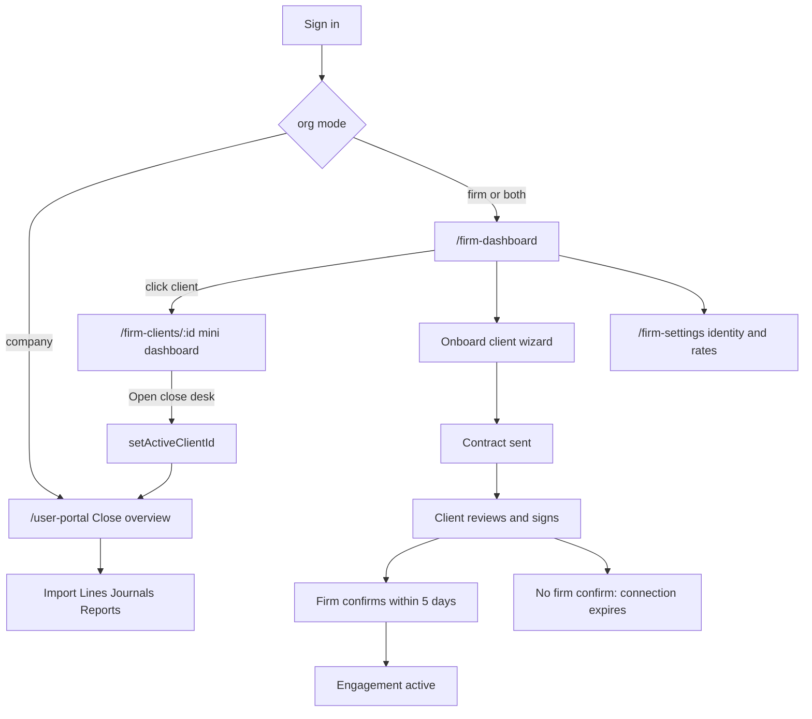
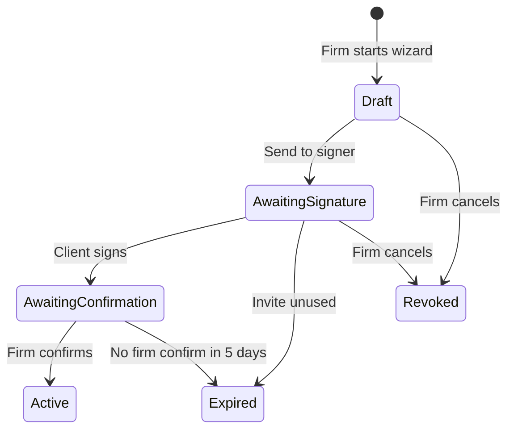

# Firm dashboard and engagement onboarding

## How it should work

Treat **firm** and **client** as two layers, not two skins of the same page.

- **Firm layer** answers: across this book of clients, what needs attention, who is on the team, and how the practice is using the product. It is also where a firm **onboards a new client engagement**.
- **Client layer** stays what it is today: Close overview, import, bank register, journals, reports.

Do **not** turn [Firm settings](artifacts/agaraccounting/src/App.tsx) into the home page, and do **not** roll financial totals across clients (currencies and reporting bases differ). Show per-client amounts and counts only.

First-run [CompanyOnboarding](artifacts/agaraccounting/src/App.tsx) stays account/firm identity only ([onboarding-domain-separation.md](.agents/memory/onboarding-domain-separation.md)). This new flow is **client engagement onboarding**, started from the firm dashboard.

Company-only users never see the firm dashboard. Dual-mode users land on the firm book; their own `company_owned` companies stay available from the account menu and Close overview.

**Billing gate (see [firm_client_billing_84ee35e7.plan.md](c:\Users\cliff\.cursor\plans\firm_client_billing_84ee35e7.plan.md)):** firms have **no Free tier**. Trial = full firm capabilities. After trial without subscribe = **hidden + read-only for 45 days**, then **locked**.

- `trialing` or Firm Pro `active`: full firm layer as in this plan (dashboard, mini-dashboard, onboarding, writes).
- `lapsed_readonly` (≤45 days after trial): **hide** Firm nav, `/firm-dashboard`, `/firm-clients/:id`, onboard wizard, firm Add-client. Subscribe screen is shown but they can still open existing firm-liable close-desk pages **read-only**. Dual-mode can use Close overview for their own companies.
- `locked` (>45 days after trial, still unsubscribed): subscribe Firm Pro is **persistent** — cannot be closed or dismissed to reach read-only firm pages. Deep links to firm-liable routes stay on the wall. Dual-mode may still open their own `company_owned` workspaces only.
- First-run `CompanyOnboarding` (create firm identity) is not gated — that starts the 15-day clock.

## Landing and navigation

Today `/` always redirects to `/user-portal`, which always renders the client `Home` in [App.tsx](artifacts/agaraccounting/src/App.tsx). Change that:

- After sign-in, onboarding complete, and invite acceptance: **firm / both** go to `/firm-dashboard` **only if** the firm is `trialing` or Firm Pro `active`; `lapsed_readonly` gets a dismissible-enough subscribe screen plus read-only close desk; `locked` gets the **persistent** subscribe wall. **company** still goes to `/user-portal`.
- Keep `/user-portal` and `/` as the **client Close overview**.
- Add a Firm group at the top of the sidebar for firm / both:
  - Firm dashboard → `/firm-dashboard`
  - Firm settings → `/firm-settings` (keep the account-menu link too)
- Keep the existing Workspace nav (Close overview through Client settings) under that group.
- On `/firm-dashboard` and `/firm-clients/:id`, the header crumb should use the **firm name / Practice**, not `Client / IFRS close`.
- Clicking a portfolio row opens the **firm client mini-dashboard** (`/firm-clients/:id`). It does **not** jump straight into the client Close overview.
- From that page, **Open close desk** sets the active client and navigates to `/user-portal`.

Empty book: primary CTA is **Onboard a client** (the engagement wizard), not the current “Add client” shortcut.

For firm / both users, **Add client** in the account menu should open this wizard, not the existing one-step `firm_client` dialog. Company-only “Add client” stays as today.

## What the dashboard shows

**Hero metrics** (firm-scoped, never a cross-client money total):

- Clients in the book (active engagements)
- Clients with pending review
- Unposted / draft lines across accessible clients
- Clients with missing FX rates
- Onboarding in flight: awaiting signature, awaiting firm confirmation, expired

**Client portfolio table** — the main surface. One row per visible client:

- Name, period, ownership, engagement/onboarding status, agreed transactions/month and revenue/year when a contract exists
- Close % (same formula as [`GET /agaraccounting/overview`](artifacts/api-server/src/routes/agaraccounting.ts))
- Pending drafts, missing rates, journal count
- Posted amount in **that client’s** functional currency
- Click opens `/firm-clients/:id` (firm mini-dashboard), including onboarding-in-flight rows so the firm can confirm, resend, or discard

**Attention queue**

- Drafts waiting / missing rates on active clients
- Awaiting client signature
- Awaiting your confirmation (show days left)
- Expired connections (resend or discard)
- Pending firm-member invitations

**Practice admin (compact, reuse existing UI):**

- Slim `FirmMembersSection` + `FirmEngagementsSection` (already in [App.tsx](artifacts/agaraccounting/src/App.tsx) ~749–853)
- Slim usage strip from `WorkspaceUsageSection` / `GET /agaraccounting/usage` with a link to Firm settings
- Full identity, FX schedule, and report attribution stay on `/firm-settings`

## Firm client mini-dashboard

A firm-layer page for one client. This is not Close overview and not Client settings. It answers: **how is this engagement tracking against the signed terms?**

Route: `/firm-clients/:id` — page file `artifacts/agaraccounting/src/pages/firm-client-dashboard.tsx`.

**Header:** client name, ownership, engagement/onboarding status, services, dates, fee note, Confirm / Resend / Discard when applicable, plus **Open close desk**.

**Close snapshot** (reuse the same numbers as client `/overview`, not a second formula): close %, pending drafts, missing rates, journal count, posted amount in the client currency.

**Agreed vs actual** — the main chart (recharts is already in the web app):

| Term | Agreed (from signed contract) | Actual (system) |
|------|-------------------------------|-----------------|
| Transactions / month | `agreedTransactionsPerMonth` | Count of **posted journal entries** in that calendar month |
| Revenue / year | `agreedRevenuePerYear` in the contract currency | **IFRS income-statement Revenue** from [`GET /agaraccounting/financial-statements`](lib/api-spec/openapi.yaml) (same “Revenue” total the reports already compute). Prefer the latest report-pack current-year revenue when a pack exists; otherwise the live statements for the client period. |

Chart v1:

- Last 12 months of posted-journal counts as bars, with a horizontal **agreed transactions/month** reference line.
- A second panel (bar or two-column compare) for **agreed annual revenue vs actual IFRS revenue**, with % of agreed and a short note when statements are empty or FX is missing.
- Variance copy: e.g. “142 posted journals this month vs 120 agreed” / “AED 1.1m IFRS revenue vs AED 1.5m agreed”.

Until the contract is signed, show agreed figures as draft terms and actuals if the firm still has workspace access. After expiry, do not expose ledger actuals.

**API:** `GET /agaraccounting/firm-clients/{clientId}/practice-overview?firmId=`

- Require active firm membership and that this client belongs to that firm.
- Return agreed terms, monthly posted-journal counts (last 12 months), current-month journal count, IFRS revenue amount + period/source (`report_pack` | `live_statements` | `unavailable`), close snapshot, onboarding status.
- Posted journals: `status = posted`, grouped by month of journal date, `clientId` scoped. Do not count drafts.
- Do not N+1 the public overview/statements endpoints from the UI; one practice-overview payload.

## Engagement onboarding (the contract)

Today a firm can create a `firm_client` and get a `provisional` row in `agaraccounting_firm_company_engagements` with no terms, no signature, and no firm confirmation ([POST /clients](artifacts/api-server/src/routes/agaraccounting.ts)). Company transfer and “invite a firm” are email accepts only — not a contract.

v1 is **firm-initiated**: the firm prepares terms in the system, the client reviews and signs, then the **firm must confirm within 5 days** or the connection expires. No DocuSign. In-app typed name + checkbox + timestamp, plus a stored PDF snapshot.

Company-initiated `firm_engagement` invites stay as they are for v1.

### What the firm defines

| Step | Fields |
|------|--------|
| Client identity | Name, legal name, functional currency, basis, close period (same as current client create) |
| Services | Multi-select: bookkeeping, statement review, journals, IFRS pack, UAE tax estimate (store as a string list) |
| Agreed volume | **Transactions per month** — required positive integer. This is the contracted monthly transaction volume, not live actuals. |
| Agreed revenue | **Revenue per year** — required amount in the client’s functional currency. This is the contracted annual revenue, not a ledger total. |
| Dates | Start date required; end date optional (empty = ongoing) |
| Fee | Free-text retainer / fee note (not payments) |
| Terms | Editable “terms of engagement” seeded from an app default template |
| Signer | Client signer email — the person who must review and sign |

These two agreed figures are first-class commercial terms. They must appear on the wizard, the frozen contract snapshot, the PDF the client signs, and the firm’s engagement/portfolio view after confirm. v1 does **not** auto-block books or bill from them; they are the agreed scope the parties signed.

Preview the generated contract (parties, services, agreed transactions/month, agreed revenue/year, dates, fee, terms, firm legal name) before send.

### Lifecycle

- **Send:** create the `firm_client` + `provisional` engagement + frozen contract snapshot + org invitation (new kind, e.g. `engagement_contract`). Invite TTL can stay 7 days (existing `WORKSPACE_INVITATION_TTL_MS`).
- **Client signs:** must be signed in as that email. Typed legal name, “I agree” checkbox, server timestamp. Append signature block to the PDF. Grant the signer **company owner** (same idea as today’s `company_transfer`). Engagement stays **not active**. Set `confirmBy = signedAt + 5 days`.
- **Firm confirms:** owner/admin only. Engagement becomes `active`. This is the real connection.
- **Expiry:** lazy-expire on dashboard load, confirm, and sign (same pattern as invitation accept). If the firm does not confirm in 5 days: mark contract + engagement `expired`, revoke the engagement, and **remove firm workspace memberships**. The client keeps the company they just signed for. If the client never signed: leave the workspace as a firm draft they can resend or discard.

Do not allow nominations or rate-profile binding to go `active` until firm confirm (today those require `status === "active"` — keep that).

### Data model

New table, e.g. `agaraccounting_engagement_contracts`, rather than overloading [firm_company_engagements](lib/db/src/schema/agaraccounting.ts):

- `engagementId`, `firmId`, `clientId`
- Frozen payload: services, agreedTransactionsPerMonth, agreedRevenuePerYear, agreedRevenueCurrency, startDate, endDate, feeNote, termsText, firmLegalName, clientLegalName
- `signerEmail`, `signerName`, `signedAt`
- `status`: `draft` | `sent` | `signed` | `confirmed` | `expired` | `revoked`
- `sentAt`, `confirmBy`, `confirmedAt`, `confirmedByUserId`
- `pdfObjectPath` (object storage, same pattern as statement evidence)
- `invitationId` (link to `organization_invitations`)

Extend engagement status check to include `expired` (`provisional` | `active` | `revoked` | `expired`).

Extend invitation `kind` with `engagement_contract`.

Reuse [reportPdf.ts](artifacts/api-server/src/lib/reportPdf.ts) canvas/PDF style for a short contract PDF generated at send and regenerated at sign (immutable after confirm). This is **not** legal-advice qualified e-sign; copy should say it is an in-app acknowledgement stored on the engagement.

### API (OpenAPI + codegen)

- `POST /firms/{firmId}/engagement-onboardings` — create draft / send (identity + services + agreedTransactionsPerMonth + agreedRevenuePerYear + dates + fee + terms + signer email)
- `GET /engagement-onboardings/{id}` — firm view
- `GET /organization-invitations/{token}/engagement-contract` — public/signed-in preview for the signer
- `POST /organization-invitations/{token}/engagement-contract/sign` — `{ signerName, accepted: true }`
- `POST /engagement-onboardings/{id}/confirm` — firm manager, only while `signed` and `now < confirmBy`
- `POST /engagement-onboardings/{id}/revoke` — firm cancel
- Include onboarding rows in `GET /agaraccounting/firm-overview` attention + portfolio status
- `GET /agaraccounting/firm-clients/{clientId}/practice-overview?firmId=` — agreed terms + posted-journal monthly series + IFRS revenue actual + close snapshot

### UI

- Wizard page: `artifacts/agaraccounting/src/pages/firm-client-onboarding.tsx` (opened from dashboard / Add client)
- Sign page: token route handled beside the existing [InviteAcceptanceGate](artifacts/agaraccounting/src/App.tsx) — review PDF/terms, type name, checkbox, sign
- Dashboard: Confirm / days-left / Resend / Discard actions on attention rows; portfolio click goes to the firm client page

## Backend: firm-scoped overview

Add `GET /agaraccounting/firm-overview?firmId=` in OpenAPI ([lib/api-spec/openapi.yaml](lib/api-spec/openapi.yaml)) and implement it next to the existing client overview in [agaraccounting.ts](artifacts/api-server/src/routes/agaraccounting.ts).

**Auth:** require an active firm membership (any role). Pass explicit `firmId`. Do not use `requireOwnedClient` or `firms[0]` / `.limit(1)`.

**Visible clients**

- Firm **owner / admin**: clients with `clients.firmId = firmId` or an engagement on that firm (including provisional / expired for attention).
- Firm **accountant / bookkeeper**: only `client_workspaces` clients associated with this firm.
- Never another firm’s clients; never a dual-mode personal company unless it is engaged with this firm.

**Response:** `firmId`, `firmName`, totals (including onboarding counts), `clients[]` with per-client close stats and onboarding status, `attention[]`. Do **not** sum `postedAmount` across clients.

One grouped SQL over statement lines / journals — do not N+1 `/overview`. Then `pnpm --filter @workspace/api-spec codegen`.

## Frontend structure

[App.tsx](artifacts/agaraccounting/src/App.tsx) is already ~5.3k lines. Follow [bank-register.tsx](artifacts/agaraccounting/src/pages/bank-register.tsx):

- `artifacts/agaraccounting/src/pages/firm-dashboard.tsx`
- `artifacts/agaraccounting/src/pages/firm-client-dashboard.tsx`
- `artifacts/agaraccounting/src/pages/firm-client-onboarding.tsx`
- Extract `FirmMembersSection` / `FirmEngagementsSection` to `artifacts/agaraccounting/src/components/firm-admin.tsx`
- Wire routes, mode-aware `/` redirect, sidebar Firm group

Reuse `PageHeading`, `Metric`, and `QueryState`.

**Out of scope for v1:** mobile, multi-firm switcher, DocuSign, payments, company-initiated contract invites, legal-qualified e-sign, team workload assignment, cross-client financials.

## Tests and memory

- Firm-overview isolation in [agaraccounting-workspace-isolation.test.ts](artifacts/api-server/test/agaraccounting-workspace-isolation.test.ts)
- Onboarding lifecycle: send requires agreed transactions/month and revenue/year; snapshot on sign matches those figures; wrong-email sign fails; sign → confirm activates; sign then wait 5 days → confirm rejected and firm access removed; never-signed invite expiry leaves a firm draft
- Practice overview: posted-journal monthly counts ignore drafts; IFRS revenue matches the statements “Revenue” total; firm B cannot read firm A’s client actuals; expired engagements hide ledger actuals
- Frontend: landing by mode; portfolio opens `/firm-clients/:id`; Open close desk goes to `/user-portal`; company-only users have no Firm dashboard / onboard wizard; lapsed firm has no dashboard / onboard wizard; locked firm subscribe wall cannot be closed to reach read-only pages
- Memory: `.agents/memory/firm-practice-dashboard.md` and `.agents/memory/firm-engagement-contracts.md` (in-app acknowledgement, 5-day firm confirm, agreed vs posted journals / IFRS revenue, no cross-client money rollup, firmId always explicit)
